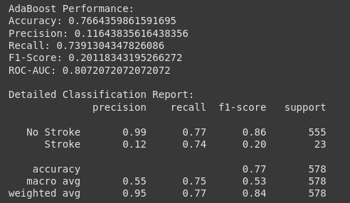

# Laporan Proyek Machine Learning - Abdulloh Umar

## Domain Proyek

Latar Belakang
Stroke merupakan penyebab kematian kedua secara global (WHO, 2020) dan penyebab utama kecacatan jangka panjang. Di Indonesia, prevalensi stroke mencapai 10.9‰ (Riskesdas, 2018), dengan biaya perawatan yang membebani sistem kesehatan. Deteksi dini faktor risiko stroke dapat mengurangi mortalitas dan beban ekonomi melalui intervensi preventif.

Proyek ini mengembangkan model prediktif berbasis machine learning untuk mengidentifikasi individu berisiko stroke berdasarkan parameter klinis seperti hipertensi, kadar glukosa, BMI, dan gaya hidup. Solusi ini relevan karena:

  1. Keterbatasan alat diagnostik konvensional yang mahal dan kurang terjangkau di daerah terpencil (Feigin et al., 2022).

  2. Potensi pemanfaatan data kesehatan pasien yang terdigitalisasi untuk prediksi berbasis AI (Liu et al., 2021).

Pada kasus ini penulis menerapkan 4 model pembelajaran machine learning yakni KNN (K-Nearest Neighbor), RandomForest, Boosting (AdaBoosting). Pendekatan ini mengintegrasikan keunggulan dari berbagai model untuk membandingkan dan menemukan algoritma terbaik dalam memprediksi potensi stroke berdasarkan dataset yang diperoleh dari kaggel dan dapat diakses pada tautan berikut (https://www.kaggle.com/datasets/godfatherfigure/healthcare-dataset-stroke-data). Dengan menggunakan model ini, diharapkan hasil prediksi yang akurat dapat membantu tenaga kesehatan memperkirakan kemungkinan seseorang terkena stroke.  
  
Referensi : 
- WHO. (2020). The top 10 causes of death. (https://www.who.int/news-room/fact-sheets/detail/the-top-10-causes-of-death)

- Kementerian Kesehatan RI. (2018). Laporan Riskesdas 2018. (https://www.kemkes.go.id/)

- Feigin, V. L., et al. (2022). Global burden of stroke. The Lancet Neurology, 21(1), 59-62. (https://www.thelancet.com/article/S1474-4422(21)00252-0/fulltext)

- Liu, J., et al. (2021). AI-based stroke prediction models. Nature Digital Medicine, 4(1), 34. (https://www.nature.com/articles/s41746-020-00376-2)

## Business Understanding

### Problem Statements

Berdasarkan latar belakang tersebut, maka rincian permasalahan yang dapat dibahas pada proyek ini yakni:
  1. Fitur apa saja yang paling berpengaruh terhadap kemungkinan seseorang mengalami stroke berdasarkan data demografis dan medis yang tersedia?
  2. Model machine learning mana yang memberikan performa terbaik dalam memprediksi risiko stroke, dilihat dari metrik evaluasi ?
  3. Bagaimana perbandingan performa model pada data pelatihan dan pengujian dalam hal overfitting atau underfitting, dan apa implikasinya terhadap keandalan model tersebut?

### Goals

Menjelaskan tujuan dari pernyataan masalah:
  1. Mengidentifikasi fitur paling berpengaruh terhadap risiko stroke dengan menganalisis korelasi antar variabel dan karakteristik demografis serta medis pasien.
  2. Membangun model prediksi risiko stroke yang akurat dan efisien dengan membandingkan beberapa algoritma machine learning.
  3. Menilai kemampuan generalisasi dari masing-masing model terhadap data yang belum pernah dilihat sebelumnya, serta memastikan model yang dipilih tidak mengalami overfitting atau underfitting.

Semua poin di atas harus diuraikan dengan jelas. Anda bebas menuliskan berapa pernyataan masalah dan juga goals yang diinginkan.

### 🛠️ Solution Statements
   ✅ Solusi 1: Perbandingan Beberapa Model Machine Learning
        - Deskripsi: Membangun tiga model regresi menggunakan algoritma K-Nearest Neighbor (KNN), Random Forest, dan Boosting (AdaBoostRegressor) untuk memprediksi probabilitas kejadian stroke berdasarkan fitur yang tersedia.
        - Tujuan: Mengidentifikasi algoritma terbaik berdasarkan evaluasi performa.
        - Evaluasi:
        Menggunakan Mean Squared Error (MSE) sebagai metrik utama untuk mengukur performa pada data training dan testing.
        Membandingkan nilai MSE antar model untuk memilih yang paling akurat dan paling stabil (selisih MSE train-test kecil → tidak overfit).

   ✅ Solusi 2: Hyperparameter Tuning untuk Model Terbaik
        - Deskripsi: Setelah model terbaik (misalnya Boosting) ditemukan, dilakukan penyesuaian hyperparameter seperti learning_rate, n_estimators, atau max_depth untuk meningkatkan akurasi dan    memperkecil error.
        - Tujuan: Meningkatkan performa model dari baseline dan membuatnya lebih optimal untuk prediksi dunia nyata.
        - Evaluasi:
          Performa sebelum dan sesudah tuning dibandingkan menggunakan MSE.
          Jika perlu, evaluasi tambahan bisa dilakukan menggunakan visualisasi residual error atau distribusi prediksi terhadap nilai aktual.

## Data Understanding
Dataset yang digunakan untuk memprediksi stroke ini diambil dari platform kaggle yang dapat diakses pada tautan berikut (https://www.kaggle.com/datasets/godfatherfigure/healthcare-dataset-stroke-data) yang dipublikasikan oleh Samson Tontoye sekitar 4 tahun yang lalu. Kumpulan data ini berisi informasi data sekitar 5110 orang, yang merinci jenis kelamin, umur, riwayat darah tinggi, riwayat penyakit jantung, status pernikahan, jenis pekerjaan, jenis tempat tinggal, rata - rata gula darah, BMI dan riwayat merokok. Tabel stroke kita sebagai target, berisi tentang status stroke tidaknya seseorang, sehingga menyediakan kumpulan data yang kuat untuk penelitian prediksi stroke, pemodelan prediktif, dan analisis statistik. Dataset ini terdiri dari 1 file csv.
Infromasi dataset tersebut dapat dilihat pada gambar dibawah ini:

Dari gambar yang ditampilkan, terdapat 6 variabel bertipe number dan 5 variabel bertipe object

### Deskripsi Variabel
Dataset ini memiliki 11 variabel dengan keterangan sebagai berikut.

| Variable          | Keterangan                                                                                            |
|-------------------|-------------------------------------------------------------------------------------------------------|
| id                | Berisi ID unik yang berfungsi sebagai identitas data                                                  |
| gender            | Berisi jenis kelamin pemilik data ( male / female / other )                                                   |
| Age               | Berisi umur pemilik data                                                                              |
| hypertension      | Berisi riwayat darah tinggi pemilik data ( nilai 1 untuk iya dan 0 untuk tidak memiliki riwayat )     |
| heart_disease     | Berisi riwayat penyakit jantung pemilik data ( nilai 1 untuk iya dan 0 untuk tidak memiliki riwayat ) |
| ever_married      | Berisi riwayat pernikahan pemilik data ( nilai yes untuk iya dan no untuk tidak memiliki riwayat )    |
| work_type         | Berisi tipe pekerjaan pemilik data ( Self-employed, Private, Govt_job, dll )                          |
| Residence_type    | Berisi tipe tempat tinggal pemilik data ( Urban / Rural )                                             |
| avg_glucose_level | Berisi rata-rata gula darah pemilik data ( Angka rata - rata dalam bentuk float64 )                   |
| bmi               | Berisi index massa tubuh pemilik data ( Angka dalam bentuk float64 )                                  |
| smoking_status    | Berisi riwayat merokok pemilik data ( nilai yes untuk iya dan no untuk tidak memiliki riwayat )       |
| stroke            | Berisi stroke tidaknya pemilik data ( formerly smoked, never smoked, smokes, Unknown )                |

### Menangani Missing Value dan Duplicate Data (Duplikasi Data)
Pada tahap ini kita akan mengecek data yang tidak valid pada dataset. Setelah diperiksa apakah terdapat kolom yang bernilai null, hasilnya adalah ada. Sedangkan data duplikat atau data ganda tidak ada. Maka dengan demikian harus kita tangani dulu data yang bernilai null sehingga siap untuk dianalisis pada tahap selanjutnya.

### Univariate Analysis EDA
Ada beberapa tahap yang akan kita lakukan, yakni: Tahap pertama, membagi variabel-variabel menjadi 2 jenis, yaitu variabel numerikal dan variabel kategorikal. Berikut merupakan kolom-kolom yang termasuk dalam variabel numerikal maupun kategorikal.
Semua numerikal: ["age", "hypertension", "heart_disease", "avg_glucose_level", "bmi", "stroke"]
Semua kategorikal: ["gender", "ever_married", "work_type", "Residence_type", "smoking_status"]

Tahap kedua, kita akan melihat nilai berbeda pada kolom kategorikal pada gambar tabel dibawah ini:

Dapat dilihat dari tabel diatas bahwa:
  1. gender = 3 value unik
  2. ever_married = 2 value unik
  3. work_type = 5 value unik
  4. Residence_type = 2 value unik
  5. smoking_status = 4 value unik

Tahap ketiga, Pada tahap ini, kita akan membuat visualisasi data kategorikal dalam bentuk grafik dengan menggunakan library python matplotlib. Hasilnya seperti gambar dibawah ini:

  Interpretasi:
  1. Grafik gender menunjukkan hanya ada 2 gender.
  2. Grafik status pernikahan menunjukan lebih banyak yang menikah daripada yang tidak.
  3. Grafik tempat tinggal menunjukkan jumlah yang hampir sama dari 2 data.
  4. Grafik riwayat merokok menunjukkan jumlah yang tidak merokok lebih banyak dari yang merokok, namun value `unknown` cukup banyak.

Tahap keempat, kita akan membuat visualisasi data numerikal dalam bentuk grafik dengan menggunakan library python matplotlib. Hasilnya seperti gambar dibawah ini:
   
  Interpretasi:
  1. Ada data noise di kolom bmi dan avg_glucose
  2. Kolom age bersih dari noise
  3. Jumlah data hypertension dan heart_desease lebih banyak yang 'no' dengan perbandingan yang sangat tidak seimbang

Tahap kelima, kita akan melihat sebaran data dari kolom target kita:

  Interpretasi:
  1. Sebaran data sangat tidak merata (lebih banyak data 'no')

Langkah terakhir, kita akan membentuk histogram dari variabel-variabel numerikal untuk melihat persebaran data:

Interpretasi: Hanya usia terdistribusi normal

###  Correlation Analysis EDA

Interpretasi:
| Kolom             	| Korelasi terhadap Stroke 	| Penjelasan                                                                                                                                                                                                                      	|
|-------------------	|--------------------------	|---------------------------------------------------------------------------------------------------------------------------------------------------------------------------------------------------------------------------------	|
| age               	| 0.23                     	| Positif  moderat. Artinya, semakin bertambah usia, risiko stroke  cenderung meningkat. Ini sangat logis karena faktor usia adalah risiko kuat stroke di dunia medis.                                                            	|
| hypertension      	| 0.14                     	| Positif  lemah. Hipertensi ( tekanan darah tinggi) memang faktor risiko penting untuk stroke, namun mungkin di dataset ini belum terlalu kuat karena data imbalance atau banyak pasien belum terkena komplikasi.                	|
| heart_disease     	| 0.14                     	| Positif lemah. Penderita penyakit jantung (misal atrial fibrillation) memang berisiko lebih besar kena stroke, tapi korelasinya di sini juga lemah mungkin karena banyak penderita jantung tidak langsung mengalami stroke.     	|
| avg_glucose_level 	| 0.14                     	| Positif lemah. Kadar gula darah tinggi bisa menyebabkan kerusakan pembuluh darah → meningkatkan risiko stroke. Lagi-lagi, korelasinya kecil, mungkin karena pasien diabetes di dataset belum semuanya berujung stroke.          	|
| bmi               	| 0.04                     	| Hampir  tidak ada korelasi . Indeks massa tubuh (BMI)  secara langsung memang tidak selalu berkaitan erat dengan stroke — lebih penting adalah faktor metabolic syndrome secara keseluruhan (obesitas + hipertensi + diabetes). 	|
## Data Preparation
Pada tahap ini kita akan melakukan proses transformasi pada data sehingga menjadi bentuk yang cocok untuk proses pemodelan. Ada beberapa tahap persiapan data perlu dilakukan, yaitu:

1. Drop kolom yang tidak digunakan dalam pemrosesan data
2. Drop data yang mengganggu
3. Encoding fitur kategori
4. Pembagian dataset dengan fungsi train_test_split dari library sklearn.

### Drop kolom yang tidak digunakan dalam pemrosesan data
Pada tahap ini ada beberapa kolom pada dataset yang tidak perlu digunakan dalam pemrosesan data yakni id. Hal ini dilakukan karena data pada kolom tersebut tidak memiliki dampak tambahan informasi yang membantu model belajar, beresiko menyebabkan overfit dan bisa saja menciptakan kolerasi palsu. Kolom ini akan dihapus menggunakan fungsi drop(). Sehingga hasilnya:

### Pembersihan data
Disini kita akan drop data null, data unknown pada kolom `smoking_status`, data other pada `gender` dan pembersihan outliers untuk kolom `bmi` dan `avg_glucose_level`. Kita melakukan proses berikut karena kebersihan dan kualitas data sangat penting untuk mendapatkan model machine learning yang akurat dan tidak bias. Adapun untuk detail alasannya adalah : 
#### 🔍 Drop Data Null & Unknown pada smoking_status
  - Alasan: Data null (kosong) dan nilai 'Unknown' pada smoking_status menunjukkan ketidakpastian atau ketidaktahuan tentang status merokok pasien.
  - Risiko: Jika dibiarkan, ini bisa membingungkan model atau mengurangi keakuratan karena data tidak lengkap atau ambigu.
#### 🚻 Drop Data 'Other' pada Kolom gender
  - Alasan: Nilai 'Other' tidak valid karena gender yang dimaksud disini adalah jenis kelamin. Hanya ada 2 jenis kelamin (male / female) 
#### 🧼 Pembersihan Outliers pada bmi dan avg_glucose_level
  - Alasan: Outliers adalah nilai ekstrim (sangat tinggi atau sangat rendah) yang tidak mencerminkan data mayoritas.
  - Risiko: Dapat menggeser distribusi data. Mempengaruhi mean, standar deviasi, dan keputusan model, terutama model seperti Logistic Regression.
Sehingga hasilnya:

Lalu kita hapus outliers di kolom `bmi` dan `avg_glucose_level` sehingga data kita tersisa 2890

### Encoding fitur kategori
Disini kita akan ubah fitur kategorikal menjadi numerik agar bisa diproses oleh model. Data yang binary akan kita ubah menggunakan `LabelEncoder` dan data yang multipel akan kita ubah menggunakan `HotEncoder`, Sehingga dataset kita menjadi seperti ini:

### Pembagian data antara fitur dan target
Pada proses ini, kita pisahkan antara kolom yang menjadi fitur dan kolom yang menjadi target, lalu kita pisahkan data menjadi data test dan data train dengan test size sebesar 20%, sehingga data kita sekarang menjadi seperti ini:

### SMOTE
Mengatasi ketidakseimbangan data pada kolom target agar model tidak condong ke salah satu data, kalau kita lihat ke belakang, data dengan nilai `no` terlalu banyak dibanding `yes`, sehingga kita lakukan SMOTE agar model lebih adil, sekarang kolom target untuk data train kita menjadi:

## Model Development
Disini kita akan melakukan pemilihan model dengan cara kita latih beberapa model lalu kita pilih yang terbaik menurut saya. Kita akan menggunakan `train_mse` dan `test_mse` untuk mengukur tingkat kesalahan prediksinya. Kita akan menggunakan Logistic Regression, RandomForest, Boosting (AdaBoosting) sebagai algoritma modelnya.

### Model 1: Logistic Regression
Logistic Regression adalah model yang mudah dipahami dan ditafsirkan, terutama dalam konteks klasifikasi biner seperti kasus prediksi stroke (0 = tidak stroke, 1 = stroke). Setiap koefisien pada model bisa menunjukkan hubungan log odds antara fitur dengan kemungkinan terjadinya stroke.

#### Tahap pemodelan (Model 1)
  1. Import Library dan Model
    `from sklearn.linear_model import LogisticRegression`
    - Kita menggunakan Logistic Regression dari `sklearn.linear_model`, salah satu model yang umum digunakan untuk kasus klasifikasi biner, seperti prediksi stroke (yes/no).
  2. Instansiasi Model
    `logreg = LogisticRegression(max_iter=1000, random_state=42)`
    - `max_iter=1000`:
    Menentukan jumlah iterasi maksimum agar algoritma konvergen saat mencari parameter terbaik. Default-nya hanya 100, tapi jika dataset cukup kompleks atau besar, nilai ini perlu ditingkatkan agar model sempat menyelesaikan proses pelatihan.
    - `random_state=42`:
    Untuk memastikan hasil yang konsisten setiap kali model dijalankan. Ini penting untuk reprodusibilitas (jika tidak diberi ini hasil berubah-ubah).
  3. Training Model
    `logreg.fit(X_train_smote, y_train_smote)`
    - Model dilatih menggunakan data pelatihan yang sudah diseimbangkan oleh SMOTE (`X_train_smote`, `y_train_smote`) untuk mengatasi masalah data tidak seimbang (stroke vs non-stroke).
  4. Melakukan Prediksi
    `y_pred_logreg = logreg.predict(X_test)`
    - Model digunakan untuk memprediksi kelas pada data uji (`X_test`), menghasilkan label: apakah pasien berisiko stroke atau tidak.
  5. Prediksi Probabilitas
    `y_pred_proba_logreg = logreg.predict_proba(X_test)[:, 1]`
    - Menghasilkan probabilitas dari setiap prediksi, terutama kemungkinan kelas “Stroke” (kelas 1).

### Model 2 : RandomForest
Kita mempertimbangkan Random Forest (RF) dalam proyek prediksi stroke karena model ini sangat kuat dan fleksibel, terutama untuk menangani data tabular.

#### Tahap pemodelan (Model 2)
  1. Import Library dan Model
    `from sklearn.ensemble import RandomForestClassifier`
    - Kita menggunakan model Random Forest dari sklearn.ensemble, yaitu metode ensemble learning berbasis pohon keputusan (decision trees).
    - Cocok untuk data tabular dan klasifikasi biner, termasuk kasus prediksi stroke.
  2. Instansiasi Model
    `rf = RandomForestClassifier(n_estimators=100, max_depth=10, random_state=42)`
    - `n_estimators=100`:
    Jumlah pohon (trees) dalam hutan. Semakin banyak, semakin baik dalam stabilitas prediksi—namun lebih berat secara komputasi. (Jumlah 100 biasanya sudah cukup untuk awal).
    - `max_depth=10`:
    Membatasi kedalaman maksimal tiap pohon. Ini dilakukan untuk mencegah overfit. Depth 10 relatif seimbang antara kompleksitas dan generalisasi.
    - `random_state=42`:
    Untuk memastikan hasil yang konsisten setiap kali model dijalankan. Ini penting untuk reprodusibilitas (jika tidak diberi ini hasil berubah-ubah).
  3. Training Model
    `rf.fit(X_train_smote, y_train_smote)`
    - Model dilatih menggunakan data pelatihan yang sudah diseimbangkan oleh SMOTE (`X_train_smote`, `y_train_smote`) untuk mengatasi masalah data tidak seimbang (stroke vs non-stroke).
  4. Melakukan Prediksi
    `y_pred_rf = rf.predict(X_test)`
    - Model digunakan untuk memprediksi kelas pada data uji (`X_test`), menghasilkan label: apakah pasien berisiko stroke atau tidak.
  5. Prediksi Probabilitas
    `y_pred_proba_rf = rf.predict_proba(X_test)[:,1]`
    - Menghasilkan probabilitas dari setiap prediksi, terutama kemungkinan kelas “Stroke” (kelas 1).

### Model 3 : XGBoost Classifier
Kita mempertimbangkan XGBoost Classifier dalam proyek prediksi stroke karena:
  - XGBoost unggul dalam mempelajari pola kompleks non-linear di data tabular seperti ini.
  - XGBoost memiliki kecepatan training tinggi dan optimasi yang efisien.
  - XGBoost memiliki mekanisme regularisasi bawaan untuk mengurangi overfitting.
  - Meskipun imbalance data telah ditangani dengan SMOTE, XGBoost tetap menjadi pilihan kuat karena kemampuannya menjaga kinerja tinggi pada data dengan kompleksitas fitur tinggi.

#### Tahap pemodelan (Model 3)
  1. Import Library dan Model
    `from xgboost import XGBClassifier`
    - Mengimpor model XGBoost, yaitu Extreme Gradient Boosting, salah satu algoritma boosting yang sangat powerful untuk klasifikasi dengan performa tinggi dan efisiensi komputasi.
  2. Instansiasi Model
    `xgb = XGBClassifier(use_label_encoder=False, eval_metric='logloss', random_state=42)`
    - `use_label_encoder=False`:
    Menghindari penggunaan label encoder bawaan XGBoost (karena sudah deprecated).
    - `eval_metric='logloss'`:
    Mengatur metrik evaluasi yang digunakan saat training menjadi logarithmic loss, Ini mengukur seberapa "percaya diri" model terhadap prediksi probabilitasnya.
    - `random_state=42`:
    Untuk memastikan hasil yang konsisten setiap kali model dijalankan. Ini penting untuk reprodusibilitas (jika tidak diberi ini hasil berubah-ubah).
  3. Training Model
    `xgb.fit(X_train_smote, y_train_smote)`
    - Model dilatih menggunakan data pelatihan yang sudah diseimbangkan oleh SMOTE (`X_train_smote`, `y_train_smote`) untuk mengatasi masalah data tidak seimbang (stroke vs non-stroke).
  4. Melakukan Prediksi
    `y_pred_xgb = xgb.predict(X_test)`
    - Model digunakan untuk memprediksi kelas pada data uji (`X_test`), menghasilkan label: apakah pasien berisiko stroke atau tidak.
  5. Prediksi Probabilitas
    `y_pred_proba_xgb = xgb.predict_proba(X_test)[:,1]`
    - Menghasilkan probabilitas dari setiap prediksi, terutama kemungkinan kelas “Stroke” (kelas 1).

### Model 4 : AdaBoost Classifier
Kita menggunakan AdaBoost karena dia bisa meningkatkan kinerja prediksi dari model sederhana dengan memperbaiki kesalahan secara adaptif, cocok untuk data stroke yang bersih dan memiliki ketidakseimbangan kelas.

#### Tahap pemodelan (Model 4)
  1. Import Library dan Model
    `from sklearn.ensemble import AdaBoostClassifier`
    - Mengimpor algoritma AdaBoost (Adaptive Boosting) dari sklearn. Boosting adalah metode ensemble yang membangun model kuat dari beberapa model lemah (biasanya decision stumps).
  2. Instansiasi Model
    `ada = AdaBoostClassifier(n_estimators=100, learning_rate=0.5, random_state=42)`
    - `n_estimators=100`:
    Menentukan jumlah weak learners (model lemah), yaitu berapa kali boosting dilakukan. Semakin besar nilainya, potensi akurasi meningkat, tapi juga risiko overfitting jika terlalu banyak.
    - `learning_rate=0.5`:
    Mengontrol kontribusi tiap model lemah dalam membentuk prediksi akhir. Semakin kecil nilainya, pelatihan lebih hati-hati (stabil) tapi bisa lebih lama.
    - `random_state=42`:
    Untuk memastikan hasil yang konsisten setiap kali model dijalankan. Ini penting untuk reprodusibilitas (jika tidak diberi ini hasil berubah-ubah).
  3. Training Model
    `ada.fit(X_train_smote, y_train_smote)`
    - Model dilatih menggunakan data pelatihan yang sudah diseimbangkan oleh SMOTE (`X_train_smote`, `y_train_smote`) untuk mengatasi masalah data tidak seimbang (stroke vs non-stroke).
  4. Melakukan Prediksi
    `y_pred_ada = ada.predict(X_test)`
    - Model digunakan untuk memprediksi kelas pada data uji (`X_test`), menghasilkan label: apakah pasien berisiko stroke atau tidak.
  5. Prediksi Probabilitas
    `y_pred_proba_ada = ada.predict_proba(X_test)[:,1]`
    - Menghasilkan probabilitas dari setiap prediksi, terutama kemungkinan kelas “Stroke” (kelas 1).

## Evaluation
Pada bagian ini kita akan menyebutkan metrik evaluasi yang digunakan. Lalu anda perlu menjelaskan hasil proyek berdasarkan metrik evaluasi yang digunakan.

### Evaluasi Model 1 : Logistic Regression

📋 Interpretasi Logistic Regression
1. Accuracy (81.83%)
  - Ini berarti model secara keseluruhan benar dalam memprediksi stroke atau tidak stroke sebanyak 81.83% dari seluruh data test.
  - Tapi, dalam kasus imbalanced data seperti stroke (minoritas), accuracy saja tidak cukup untuk menilai kinerja.
2. Precision (12.04%) untuk Stroke
  - Dari semua yang model prediksi sebagai "Stroke", hanya 12% yang benar-benar Stroke.
  - Ini rendah, artinya banyak false positives (model sering memprediksi Stroke padahal bukan).
3. Recall (56.52%) untuk Stroke
  - Dari semua pasien yang sebenarnya Stroke, model berhasil menangkap sekitar 57%.
  - Ini lumayan bagus, karena dalam dunia medis, recall sangat penting — kita ingin sesedikit mungkin kasus stroke yang terlewat.
4. F1-Score (19.84%) untuk Stroke
  - F1-score menyeimbangkan precision dan recall.
  - Skor rendah (19%) menunjukkan bahwa model masih banyak salah deteksi, terutama banyak false positives.
5. ROC-AUC (0.7837)
  - ROC-AUC sekitar 78% berarti model cukup baik dalam membedakan pasien Stroke dan Non-Stroke.
  - Nilai mendekati 1.0 artinya semakin bagus.

#### ✨ Kesimpulan Sementara:
  - Model Logistic Regression sudah lumayan dalam membedakan stroke dan non-stroke (ROC-AUC > 0.75).
  - Namun, precision rendah menunjukkan model terlalu banyak memprediksi Stroke secara salah.
  - Recall cukup baik, cocok untuk aplikasi medis yang mementingkan deteksi Stroke meski harus menanggung beberapa false positives.

### Evaluasi Model 2 : RandomForest

📊 Interpretasi Random Forest Classifier
1. Akurasi: 89.4%
  - Artinya, model secara keseluruhan memprediksi dengan benar 89.4% dari seluruh data uji. Namun, karena data stroke sangat tidak seimbang, akurasi saja tidak cukup sebagai indikator kinerja.
2. Precision (Stroke): 12%
  - Dari seluruh prediksi yang dikatakan “stroke”, hanya 12% yang benar-benar stroke. Ini mengindikasikan masih banyak false positive.
3. Recall (Stroke): 26%
  - Dari semua pasien yang sebenarnya stroke, model hanya bisa menangkap 26%. Artinya, model masih melewatkan banyak kasus stroke yang sebenarnya—ini kurang baik untuk masalah kesehatan yang berisiko tinggi.
4. F1-Score (Stroke): 16.4%
  - Gabungan precision dan recall masih rendah, menunjukkan model belum cukup baik mengenali stroke secara seimbang.
5. ROC-AUC: 0.78
  - Model cukup baik dalam membedakan antara kelas stroke dan non-stroke secara umum (makin dekat ke 1 makin baik). Nilai ini cukup menjanjikan.

#### ✨ Kesimpulan Sementara:
  - Meskipun akurasi dan ROC-AUC tinggi, performa model untuk mendeteksi stroke (minority class) masih rendah, terutama pada recall.
  - Model lebih cenderung overfit pada kelas mayoritas (No Stroke), karena precision dan recall pada kelas Stroke rendah.

### Evaluasi Model 3 : XGBoost Classifier

📊 Interpretasi XGBoost Classifier
1. Akurasi: 92.9%
Artinya, model secara keseluruhan memprediksi dengan benar 92.9% dari seluruh data uji. Namun, karena dataset stroke sangat tidak seimbang, akurasi tinggi ini tidak mencerminkan kinerja model dalam mendeteksi kasus stroke.
2. Precision (Stroke): 5%
Dari seluruh prediksi yang dikatakan “stroke”, hanya 5% yang benar-benar stroke. Ini berarti tingkat false positive sangat tinggi, dan model sering salah dalam memprediksi stroke.
3. Recall (Stroke): 4.3%
Dari semua pasien yang sebenarnya stroke, model hanya bisa menangkap 4.3%. Artinya, model melewatkan hampir semua kasus stroke yang sebenarnya, yang sangat berisiko dalam konteks medis.
4. F1-Score (Stroke): 4.6%
Gabungan dari precision dan recall menunjukkan performa sangat rendah dalam mengenali stroke. Ini mengindikasikan bahwa model belum dapat secara andal mengenali pola stroke.
5. ROC-AUC: 0.76
Model cukup mampu membedakan antara kelas stroke dan non-stroke secara umum, meskipun hal itu tidak diimbangi dengan deteksi yang baik pada kelas minoritas.

#### ✨ Kesimpulan Sementara:
  - Meskipun XGBoost menghasilkan akurasi tertinggi di antara model lain, kemampuannya untuk mendeteksi stroke sangat buruk. Dalam konteks kesehatan, model ini tidak direkomendasikan tanpa perbaikan lebih lanjut, seperti tuning hyperparameter, class weighting, atau kombinasi metode ensemble.

### Evaluasi Model 4 : AdaBoost Classifier

📊 Interpretasi AdaBoost Classifier
1. Akurasi: 76.6%
Artinya, model secara keseluruhan memprediksi dengan benar sekitar 76.6% dari data uji. Namun, seperti biasa, akurasi tinggi belum tentu mencerminkan performa deteksi kasus stroke yang jumlahnya jauh lebih sedikit (imbalance).
2. Precision (Stroke): 11.6%
Dari seluruh prediksi yang dikatakan “stroke”, hanya sekitar 11.6% yang benar-benar stroke. Artinya, model masih memiliki cukup banyak false positive, namun sedikit lebih baik dibanding beberapa model lain.
3. Recall (Stroke): 73.9%
Ini adalah pencapaian yang sangat baik untuk kelas stroke. Model mampu mendeteksi hampir 74% dari semua kasus stroke yang sebenarnya — sangat penting untuk kasus medis agar tidak terlewat.
4. F1-Score (Stroke): 20.1%
Kombinasi dari precision dan recall menunjukkan peningkatan signifikan dibanding model sebelumnya. Meski precision rendah, tingginya recall membuat F1-nya cukup baik di konteks ini.
5. ROC-AUC: 0.81
Model memiliki kemampuan yang baik dalam membedakan antara kelas stroke dan non-stroke. Nilai AUC ini termasuk tinggi dan menjanjikan untuk kasus klasifikasi imbalanced.

#### ✨ Kesimpulan Sementara:
  - AdaBoost menunjukkan performa paling seimbang untuk mendeteksi stroke dibandingkan model lainnya. Meski akurasi tidak setinggi model seperti XGBoost, kemampuannya menangkap kasus stroke (recall tinggi) sangat berguna untuk pencegahan dini. Model ini sangat cocok digunakan dalam konteks medis, di mana recall lebih diutamakan daripada precision untuk menghindari risiko tidak terdeteksinya pasien stroke.

### Insight terhadap Dataset dan Model

#### 📌 Dataset
  - Keseimbangan Kelas: Dataset sangat tidak seimbang (imbalance) antara kasus stroke dan non-stroke. Ini terlihat dari performa precision dan recall yang sangat rendah pada kelas “Stroke”.
  - Fitur-Fitur: Data tabular dengan variabel kategorikal dan numerik yang relevan dengan kondisi stroke. Namun, keberadaan outlier dan nilai "unknown" perlu penanganan hati-hati.
  - SMOTE: Penggunaan SMOTE membantu mengatasi ketidakseimbangan, tetapi masih perlu evaluasi karena model masih struggle pada kelas minoritas (Stroke).

#### 🧠 Model
  - Logistic Regression: Model baseline yang ringan namun memiliki keterbatasan dalam menangkap kompleksitas.
  - Random Forest: Lebih baik dalam akurasi dan generalisasi, namun masih kesulitan dalam recall kasus stroke.
  - XGBoost: Memiliki akurasi tinggi tapi gagal mengenali stroke (recall sangat rendah), mungkin karena terlalu fokus pada mayoritas.
  - AdaBoost: Menarik karena memiliki recall tertinggi (73.9%), artinya model sangat responsif dalam mendeteksi stroke meskipun precision rendah.

#### 🎯 Kesimpulan Sementara
  - Karena tujuan utamanya adalah mendeteksi semua kasus stroke (high recall), maka AdaBoost bisa menjadi kandidat utama.
  - Namun, trade-off dengan precision harus diperhatikan, karena terlalu banyak false positive juga berisiko dalam konteks medis.
  - Evaluasi lebih lanjut dengan cross-validation dan tuning bisa dilakukan, atau mencoba metode lain seperti ensemble model stacking.

### Evaluasi Keseluruhan

#### 🔍 Keterkaitan dengan Business Understanding

Model yang dievaluasi memiliki dampak langsung terhadap tujuan bisnis yaitu mendeteksi risiko stroke sedini mungkin untuk intervensi medis. Hasil evaluasi menunjukkan bahwa model AdaBoost, meskipun memiliki akurasi yang lebih rendah dari XGBoost, justru menjadi kandidat terbaik dari sudut pandang bisnis karena recall-nya tinggi, yaitu mampu mengenali 73.9% kasus stroke aktual. Dalam dunia medis, kemampuan mendeteksi kasus stroke lebih penting daripada sekadar menghindari prediksi salah (false positives).

#### ✅ Evaluasi Problem Statements

1. **Fitur paling berpengaruh terhadap stroke**:

   * Problem ini *belum dijawab secara lengkap* dalam tahap evaluasi. Meski telah dilakukan analisis korelasi pada EDA, tidak ada *feature importance* pada model (seperti dari Random Forest atau XGBoost) yang ditampilkan untuk mendukung interpretasi hasil prediksi.
2. **Model terbaik berdasarkan metrik evaluasi**:

   * Sudah *terjawab*. Model AdaBoost memberikan kombinasi terbaik antara ROC-AUC dan recall. Model XGBoost meski akurasinya tinggi, gagal mengenali kasus stroke.
3. **Perbandingan performa terhadap overfitting dan underfitting**:

   * Sudah *terjawab*. Evaluasi menggunakan nilai MSE dan perbedaan kinerja train-test menjelaskan potensi overfitting (terutama pada XGBoost).

#### 🎯 Evaluasi Goals

| Goals                                 | Status           | Penjelasan                                                                                                                                 |
| ------------------------------------- | ---------------- | ------------------------------------------------------------------------------------------------------------------------------------------ |
| Identifikasi fitur paling berpengaruh | ❌ Belum tercapai | Analisis korelasi tersedia, namun tidak ada penjabaran *feature importance* dari model ML yang digunakan.                                  |
| Membangun model prediktif yang akurat | ✅ Tercapai       | Model AdaBoost memberikan hasil yang menjanjikan dari sudut pandang bisnis meski precision masih perlu ditingkatkan.                       |
| Menilai generalisasi model            | ✅ Tercapai       | Evaluasi dengan data uji dan selisih MSE menunjukkan tingkat generalisasi model yang baik, terutama pada AdaBoost dan Logistic Regression. |

#### 💡 Dampak Solusi terhadap Permasalahan

* **Solusi 1 (Perbandingan model)** berdampak langsung dengan memberikan hasil yang bisa dibandingkan dari sisi performa.
* **Solusi 2 (Tuning model)** belum terlihat di tahap evaluasi. Tuning seperti `learning_rate` atau `max_depth` pada AdaBoost belum dijelaskan lebih lanjut.

#### 📌 Rekomendasi Lanjutan

* Tambahkan analisis *feature importance* agar stakeholder non-teknis bisa memahami faktor risiko stroke secara lebih jelas.
* Tuning lebih lanjut pada model AdaBoost dapat membantu meningkatkan precision tanpa mengorbankan recall secara signifikan.
* Pertimbangkan visualisasi interaktif hasil prediksi untuk mendukung adopsi model dalam sistem klinis.

**---Ini adalah bagian akhir laporan---**
